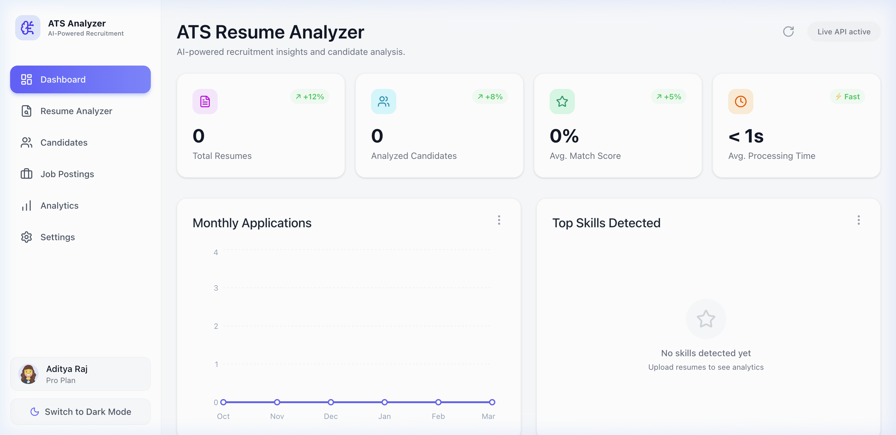
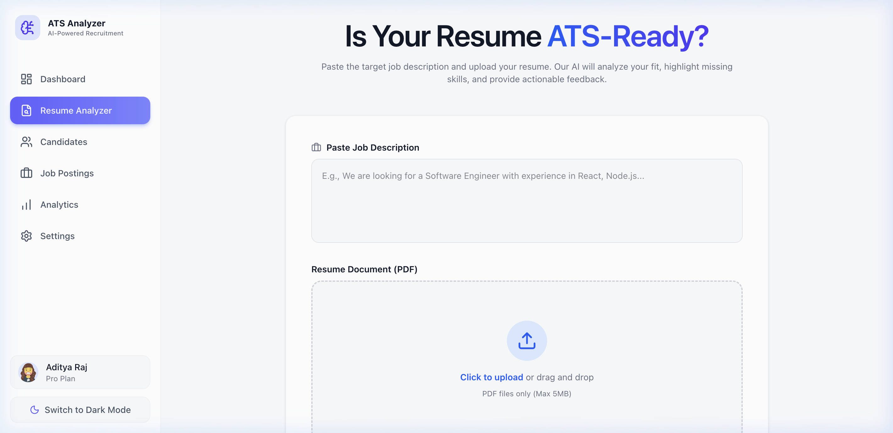
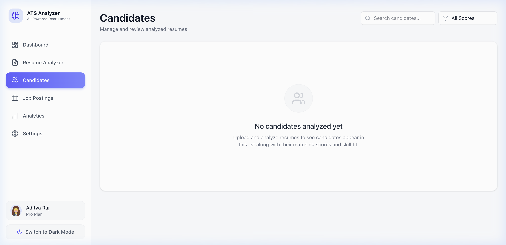
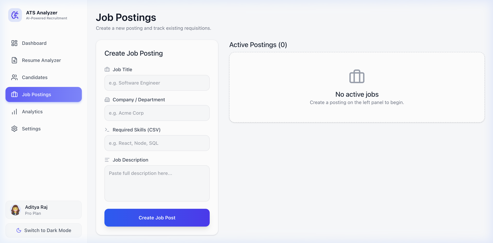
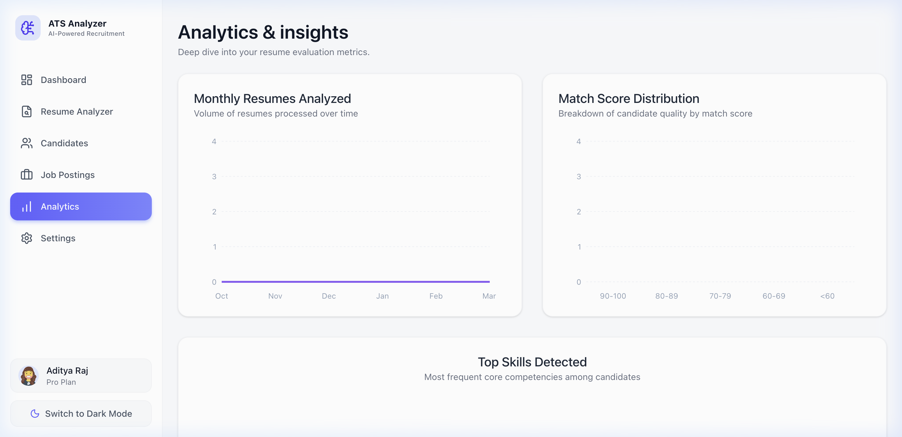
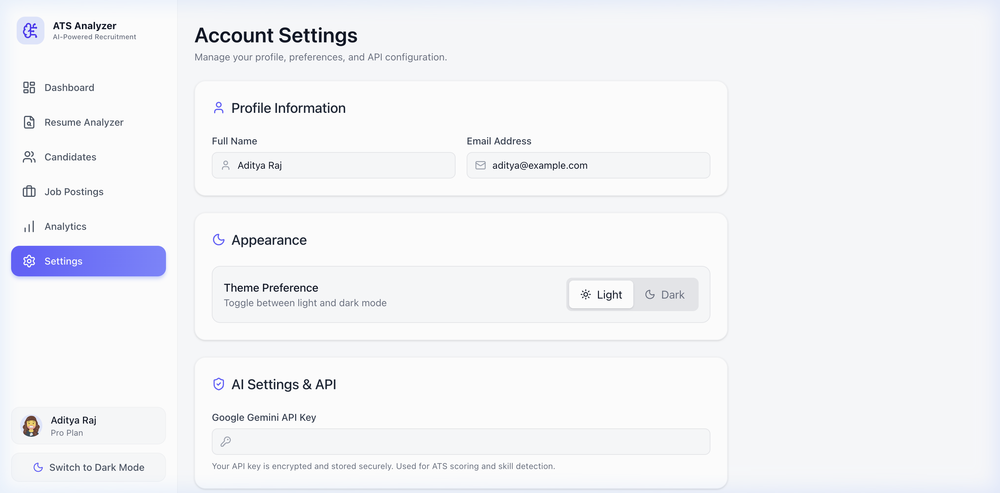

<p align="center">
  
</p>

<h1 align="center">🧠 AI Resume Analyzer</h1>

<p align="center">
  <strong>An AI-powered ATS (Applicant Tracking System) that analyzes resumes against job descriptions using Google Gemini AI.</strong>
</p>

<p align="center">
  
  
  
  
  
  
</p>

---

## 📸 Screenshots

### Dashboard
> Real-time KPI cards, monthly application trends, and top skills detection — all in one glance.



---

### Resume Analyzer
> Upload a PDF resume and paste a job description. The AI instantly evaluates ATS compatibility, match score, missing skills, and provides actionable suggestions.



---

### Candidates
> Browse, search, and filter all analyzed candidates. View detailed analysis with a single click.



---

### Job Postings
> Create and manage job requisitions. Track active openings with required skills and descriptions.



---

### Analytics & Insights
> Visualize recruitment data with area charts, bar charts, and donut charts — monthly uploads, score distributions, and top skills at a glance.



---

### Settings
> Manage profile information, toggle dark/light theme, and configure your Google Gemini API key.



---

## ✨ Features

| Feature | Description |
|---|---|
| 🤖 **AI Resume Analysis** | Powered by Google Gemini to score resumes against job descriptions |
| 📊 **ATS Match Score** | Instant percentage-based compatibility scoring |
| 🔍 **Skill Gap Detection** | Identifies missing and matched skills automatically |
| 💡 **Actionable Suggestions** | AI-generated improvement recommendations |
| 📈 **Analytics Dashboard** | Visual charts for monthly trends, score distributions, and skill breakdowns |
| 👥 **Candidate Management** | Search, filter, view, and delete analyzed candidates |
| 💼 **Job Postings** | Create and manage job requisitions with required skills |
| 🌙 **Dark / Light Mode** | Full theme support with smooth transitions |
| 📄 **PDF Preview** | In-browser resume preview alongside analysis results |
| ⚡ **Real-time Updates** | Live API status, SWR data fetching with auto-revalidation |

---

## 🏗️ Tech Stack

### Frontend
- **React 19** with Vite 7 for blazing-fast HMR
- **TailwindCSS 4** for utility-first styling
- **Framer Motion** for smooth animations & transitions
- **Recharts** for interactive data visualizations (Line, Area, Bar, Pie charts)
- **Lucide React** for beautiful, consistent icons
- **SWR** for efficient data fetching & caching
- **React Router DOM v7** for client-side routing

### Backend
- **Node.js** with **Express 5**
- **MongoDB** with **Mongoose** ODM
- **MongoDB Memory Server** for zero-config local development
- **Google Generative AI SDK** (`@google/generative-ai`) for Gemini API integration
- **Multer** for PDF file upload handling
- **pdf-parse** for extracting text content from resumes

---

## 📁 Project Structure

```
ai-resume-analyzer/
├── client/                    # React Frontend
│   ├── src/
│   │   ├── components/        # Reusable UI components
│   │   │   ├── ui/            # Design system primitives
│   │   │   ├── AnalysisResult.jsx
│   │   │   ├── Layout.jsx
│   │   │   ├── Sidebar.jsx
│   │   │   └── UploadDropzone.jsx
│   │   ├── pages/             # Application pages
│   │   │   ├── Dashboard.jsx
│   │   │   ├── Home.jsx       # Resume Analyzer page
│   │   │   ├── Candidates.jsx
│   │   │   ├── Jobs.jsx
│   │   │   ├── Analytics.jsx
│   │   │   └── Settings.jsx
│   │   ├── hooks/             # Custom React hooks
│   │   ├── services/          # API service layer
│   │   └── utils/             # Design system & utilities
│   ├── index.html
│   ├── package.json
│   └── vite.config.js
│
├── server/                    # Express Backend
│   ├── controllers/           # Route handlers
│   ├── models/                # Mongoose schemas
│   │   ├── Candidate.js
│   │   ├── Job.js
│   │   └── Settings.js
│   ├── routes/                # API route definitions
│   │   ├── resume.js
│   │   ├── candidateRoutes.js
│   │   ├── jobRoutes.js
│   │   ├── analyticsRoutes.js
│   │   └── settingsRoutes.js
│   ├── services/              # Business logic (AI analysis)
│   ├── uploads/               # Uploaded resume files
│   ├── index.js               # Server entry point
│   └── package.json
│
├── screenshots/               # UI screenshots
└── README.md
```

---

## 🚀 Getting Started

### Prerequisites

- **Node.js** >= 18.x
- **npm** >= 9.x
- **Google Gemini API Key** — [Get one here](https://aistudio.google.com/apikey)

### 1. Clone the Repository

```bash
git clone https://github.com/your-username/ai-resume-analyzer.git
cd ai-resume-analyzer
```

### 2. Setup the Backend

```bash
cd server
npm install
```

Create a `.env` file in the `server/` directory:

```env
PORT=5001
GEMINI_API_KEY=your_google_gemini_api_key_here
```

> **Note:** MongoDB is handled automatically using an in-memory server (`mongodb-memory-server`). No external MongoDB installation is required for local development.

Start the backend server:

```bash
npm run dev
```

The server will start on `http://localhost:5001`.

### 3. Setup the Frontend

```bash
cd client
npm install
npm run dev
```

The frontend will start on `http://localhost:5173`.

### 4. Open in Browser

Navigate to [http://localhost:5173](http://localhost:5173) and start analyzing resumes! 🎉

---

## 🔌 API Endpoints

| Method | Endpoint | Description |
|--------|----------|-------------|
| `POST` | `/api/resume/analyze` | Upload & analyze a resume PDF against a job description |
| `GET` | `/api/candidates` | Get all analyzed candidates |
| `DELETE` | `/api/candidates/:id` | Delete a candidate record |
| `GET` | `/api/jobs` | Get all job postings |
| `POST` | `/api/jobs` | Create a new job posting |
| `DELETE` | `/api/jobs/:id` | Delete a job posting |
| `GET` | `/api/analytics` | Get analytics data (monthly uploads, score distribution, top skills) |
| `GET` | `/api/settings` | Get application settings |
| `PUT` | `/api/settings` | Update application settings (e.g., API key) |

---

## 🎨 Design Highlights

- **Glassmorphism cards** with subtle shadows and rounded corners
- **Gradient accents** on active navigation and buttons
- **Staggered animations** on page load using Framer Motion
- **Skeleton loading states** for smooth data transitions
- **Responsive layout** with a persistent sidebar navigation
- **Dark mode support** with seamless theme toggling
- **Interactive charts** with hover tooltips and smooth curves
- **Color-coded scoring** — Green (≥80), Yellow (≥50), Red (<50)

---

## 📝 How It Works

1. **Upload Resume** — Drop a PDF resume on the upload zone
2. **Paste Job Description** — Enter the target job's requirements
3. **AI Analysis** — Google Gemini parses your resume text and evaluates it against the job description
4. **Get Results** — View your ATS match score, matched/missing skills, and personalized improvement tips
5. **Track Candidates** — All analyzed resumes are saved and searchable in the Candidates dashboard

---

## 🤝 Contributing

Contributions are welcome! Please feel free to submit a Pull Request.

1. Fork the repository
2. Create your feature branch (`git checkout -b feature/amazing-feature`)
3. Commit your changes (`git commit -m 'Add amazing feature'`)
4. Push to the branch (`git push origin feature/amazing-feature`)
5. Open a Pull Request

---

## 📄 License

This project is open-source and available under the [MIT License](LICENSE).

---

<p align="center">
  Made with ❤️ by <strong>Aditya Raj</strong>
</p>
